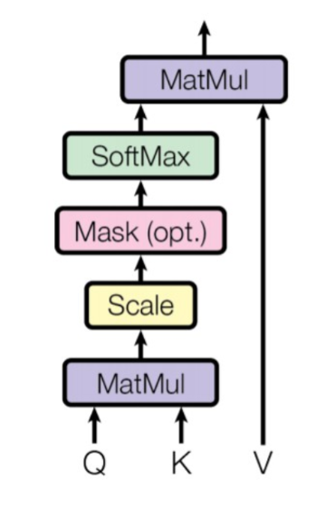

# Attention Mechanism

## Overview

Attention mechanisms have become an integral part of many state-of-the-art neural network architectures.Introduced to address the limitations of traditional neural networks in handling long-range dependencies, attention mechanisms enable models to dynamically focus on relevant parts of the input sequence as needed. Attention mechanism improved the performance of the encoder-decoder model for machine translation.

## Table of Contents
1. [Introduction](#introduction)
2. [Bahdanau Attention](#bahdanau-attention)
3. [How Attention Works](#how-attention-works)
    1. [Basic Concepts](#basic-concepts)
    2. [Scaled Dot-Product Attention](#scaled-dot-product-attention)
    3. [Multi-Head Attention](#multi-head-attention)
4. [Types of Attention Mechanisms](#types-of-attention-mechanisms)
    1. [Soft vs. Hard Attention](#soft-vs-hard-attention)
    2. [Self-Attention](#self-attention)
    3. [Global vs. Local Attention](#global-vs-local-attention)
5. [References](#references)

## Introduction
We often apply attention mechanism in real life - for example,  while reading an article, while listening to someone talk in a crowded scenario - our auditory system employs selective attention to focus on relevant information. Similarly, in the context of deep learning, attention mechanism allows neural networks to selectively focus on parts of the input data, enhancing the ability to capture important information and improving performance on tasks involving sequences. Initially introduced in the context of machine translation, attention mechanisms have since been adopted and adapted across various domains. Google Streetview’s house number identification is an example of an attention mechanism in Computer vision that enables models to systematically identify particular portions of an image for processing. 
  - Mechanism inspired by the human visual system
    - We don't see the entire world at once
    - Only small patch is in focus
    - Saccades = eye movement to scan the environment until sufficient information is available for recognition
    - Processing is dynamically restricted to a subset of the visual field
    - 2 Questions: What to look at & Where to look!
  - Attempts made to transfer such a mechanism to AI tasks
  - Remarkable performance has been achieved using this mechanism

Traditional neural networks, including recurrent neural networks (RNNs) and convolutional neural networks (CNNs), face challenges in processing long sequences or capturing global context. The attention mechanism addresses these challenges by allowing the model to weigh different parts of the input differently, focusing on the most relevant parts when making predictions.

## Bahdanau (Additive) Attention
Attention mechanism was introduced by Bahdanau et al.(2014). It consisted of the following steps:
- **Alignment Scores** : alignment model takes the encoded hidden states ${h_i}$ and the previous decoder output ${s_{t-1}}$ and computes a score ${e_{t,i}}$. This score indicates how well the elements of the input sequence align with the current output at position ${t}$. ${{e_{t,i}} = a({s_{t-1}}, {h_i})}$
- **Weights** : The weights, ${\alpha_{t, i}}$, are computed by applying a softmax operation to the previously computed alignment scores: ${\alpha_{t, i}} = {softmax(e_{t, i})}$
- **Context Vector** - A unique context vector, ${c_t}$, is fed into the decoder at each time step. It is computed by a weighted sum of all, ${T}$, encoder hidden states: ${c_t = \sum_{i=1}^{T}\alpha_{t, i} h_i}$
Bahdanau et al. implemented an RNN for both the encoder and decoder. However, the attention mechanism can be re-formulated into a general form that can be applied to any sequence-to-sequence (abbreviated to seq2seq) task, where the information may not necessarily be related in a sequential fashion.

## How Attention Works

### Basic Concepts

The attention mechanism is based on the idea of creating weighted representations of the input data, where the weights indicate the importance of each part of the input. The core components of the attention mechanism are:

- **Query (Q)**: The vector that represents the current state of the model. This vector represents the information that the model wants to focus on or retrieve from the input. 
- **Key (K)**: The vectors that represent the candidates for attention. 
- **Value (V)**: The vectors that represent the content associated with each key.

The attention mechanism computes a weighted sum of the values, where the weights are derived from the query and keys.

### Scaled Dot-Product Attention

The scaled dot-product attention is a specific implementation of the attention mechanism. It computes the attention scores as follows:

1. Compute the dot products of the query with all keys to get the raw attention scores.
2. Scale the raw scores by the square root of the dimension of the keys.
3. Apply a softmax function to obtain the attention weights.
4. Multiply the weights by the corresponding values to get the final output.

Mathematically, this is represented as:

${\text{Attention}(Q, K, V) = \text{softmax}\left(\frac{QK^T}{\sqrt{d_k}}\right) V}$

where ${d_k}$ is the dimension of the keys.

### Multi-Head Attention

Multi-head attention extends the scaled dot-product attention by using multiple attention heads. Each head performs attention independently and their outputs are concatenated and linearly transformed. This allows the model to jointly attend to information from different representation subspaces.

Mathematically:

$
{\text{MultiHead}(Q, K, V) = \text{Concat}(\text{head}_1, \ldots, \text{head}_h)W^O}
$

where each head is computed as:

${\text{head}_i = \text{Attention}(QW_i^Q, KW_i^K, VW_i^V)}$

## Implementations
|Name|Citation|  
|---|---|  
|Additive Attention|[Bahdanau et al., 2015](https://arxiv.org/pdf/1409.0473.pdf)|  
|Dot-Product Attention|[Luong et al., 2015](https://arxiv.org/pdf/1508.04025.pdf)|  
|Location-Aware (Location Sensitive) Attention|[Chorowski et al., 2015](http://papers.nips.cc/paper/5847-attention-based-models-for-speech-recognition.pdf)|    
|Scaled Dot-Product Attention|[Vaswani et al., 2017](https://arxiv.org/abs/1706.03762)|  
|Multi-Head Attention|[Vaswani et al., 2017](https://arxiv.org/abs/1706.03762)|
|Relative Multi-Head Self Attention|[ZihangDai et al., 2019](https://arxiv.org/abs/1901.02860)|  

## Types of Attention Mechanisms

### Soft vs. Hard Attention

- **Soft Attention**: 
    
    Alignment weights are learned and placed "softly" over all patches in the source image. Differentiable and allows the model to learn the attention weights through backpropagation. It considers all parts of the input with varying degrees of importance. The model is smooth and differentiable, however, it is expensive when the source input is large.

- **Hard Attention**: 
    
    This type of attention only selects one patch of the image to attend to at a time. Non-differentiable and involves making discrete choices about which part of the input to focus on. It requires techniques like reinforcement learning for training. Pros: Less calculation at inference time. Cons: Model is non-differentiable and requires complicated techniques to train.

### Self-Attention

Self-attention (or intra-attention) is a mechanism where the query, key, and value vectors come from the same source. It allows the model to consider the relationships between different positions in the same sequence.

### Global vs. Local Attention

- **Global Attention**: Considers all positions in the input sequence when computing attention weights.
- **Local Attention**: Restricts the focus to a local neighborhood around each position, which can reduce computational complexity and improve efficiency.

## References

- Vaswani, A., et al. (2017). [Attention is All You Need](https://arxiv.org/abs/1706.03762). arXiv:1706.03762.
- Bahdanau, D., Cho, K., & Bengio, Y. (2014). [Neural Machine Translation by Jointly Learning to Align and Translate](https://arxiv.org/abs/1409.0473). arXiv:1409.0473.
- Luong, M. T., Pham, H., & Manning, C. D. (2015). [Effective Approaches to Attention-based Neural Machine Translation](https://arxiv.org/abs/1508.04025). arXiv:1508.04025.
- [Attention Mechanism from Scratch](https://machinelearningmastery.com/the-attention-mechanism-from-scratch/#:~:text=The%20idea%20behind%20the%20attention,being%20attributed%20the%20highest%20weights.)
- https://www.geeksforgeeks.org/ml-attention-mechanism/
- https://d2l.ai/chapter_attention-mechanisms-and-transformers/index.html
- https://paperswithcode.com/methods/category/attention-mechanisms-1
- https://lilianweng.github.io/posts/2018-06-24-attention/
