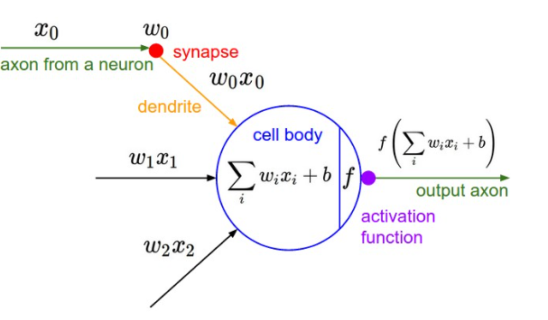

## MicroGrad

This is an implementation of micrograd - a tiny autograd engine developed by Andrej Karpathy. The link to the original implementation can be found here: https://github.com/karpathy/micrograd

### Important Links
https://www.youtube.com/watch?v=VMj-3S1tku0  
https://github.com/karpathy/micrograd  
https://karpathy.ai/  

### Notes
MicroGrad is a tiny auto grad engine that implements backpropagation. Backpropagation is an algorithm we use to estimate gradients. It’s an application of chain rule through the expression graph. Unlike traditional implementations that operate on vectors for parallelization and speed, MicroGrad processes backpropagation at a scalar level, offering a fundamental, low-level perspective on how the algorithm works.
  
<strong>Understanding derivatives: </strong> slope of a line tangent to the function's graph at that point - how much the function's value will change if the input is slightly nudged in one direction or another. 
 
\

 

Neuron  
